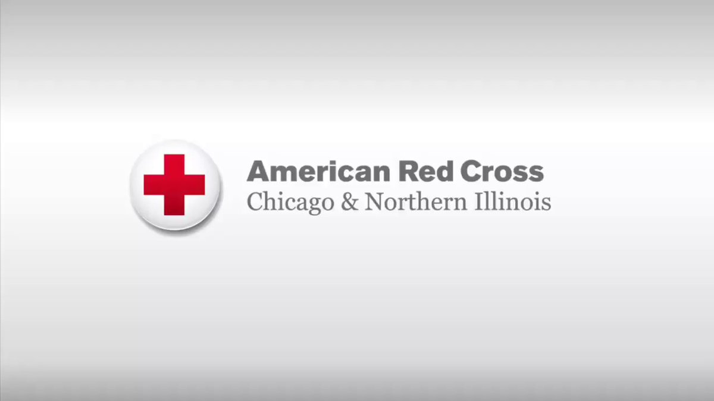

# Overview

Welcome to the WiDS Data Dive, in partnership with the Illinois Red Cross. .

You will have 90 minutes to complete the following task. Below is a plot of number of incidents per month from 2014-2018 that the Illinois Red Cross responded to. As you can see, even ignoring seasonality, we observe a *drop* in total incidents in 2018. Our questions is simple: **Why**?

The data is described more below in the codebook. We will give you access to: 
* Red Cross incident data
* Shapefile for zip codes in Chicago, along with a R file that will join the latitude/longitude in the Red Cross data
* Weather data

##Goal
Please email your 2 slides

# The Data
We give you access to shapefile data for Chicago, 

## Codebook
The code book will list each variable name with a description followed by the variable type in italics. If variable is categorical responses will be listed.

\begin{itemize}
  \list Date - The date of the incident *Date dd/mm/yyyy*
  \list Incident_num - A unique incident number for the specific incident
  \list Incident_type - The type of situation that lead to an incident. Include
  \begin{itemize}
      \list Blizzard
      \list Building Collapse
      \list Explosion
      \list Fire
      \list Flood
      \list HazMat
      \list No response needed - Arrived on scence and assistance was not needed presently.
      \list Police
      \list Search and rescue 
      \list Storm
      \list Tornado
      \list Transportation
      \list Vacate
  
  \end{itemize}

\end{itemize}
## Download

# Let's Get To Work
## Cleaning
## Shape Files