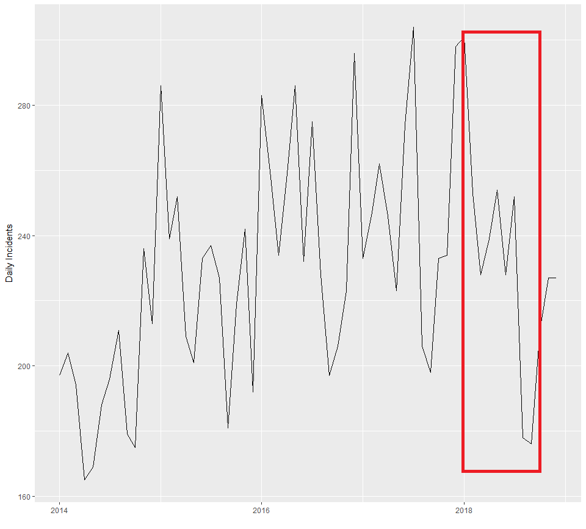

# Overview

Welcome to the WiDS Data Dive, in partnership with the Chicago/Illinois Red Cross.

You will have **90 minutes** to complete the following task. 

Below is a plot of number of incidents per month from 2014-2018 that the Illinois Red Cross responded to. As you can see, even ignoring seasonality, we observe a *drop* in total incidents in 2018. Our questions is simple: **Why**?

The data is described more below in the [thedata](#The-Data). We will give you access to: 
* Red Cross incident data
* Shapefile for zip codes in Chicago, along with a R file that will join the latitude/longitude in the Red Cross data
* Weather data

## Goal
Please email your 2 slides to als1@u.northwestern.edu. 

# The Data
We give you access to shapefile data for Chicago, 

## Codebook
The code book will list each variable name with a description followed by the variable type in italics. If variable is categorical responses will be listed.

  * Date - The date of the incident *Date dd/mm/yyyy*
  * Incident_num - A unique incident number for the specific incident *Character*
  * Incident_type - The type of situation that lead to an incident. *Character*
      + Blizzard
      + Building Collapse
      + Explosion
      + Fire
      + Flood
      + HazMat
      + No response needed - Arrived on scence and assistance was not needed presently.
      + Police
      + Search and rescue 
      + Storm
      + Tornado
      + Transportation
      + Vacate
  

## Download

# Let's Get To Work
## Cleaning
## Shape Files